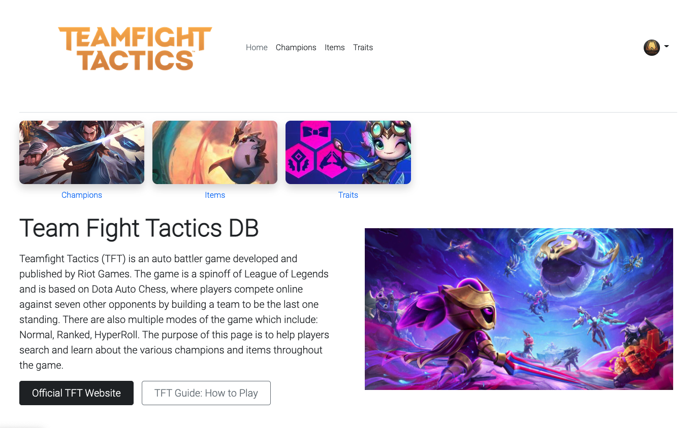
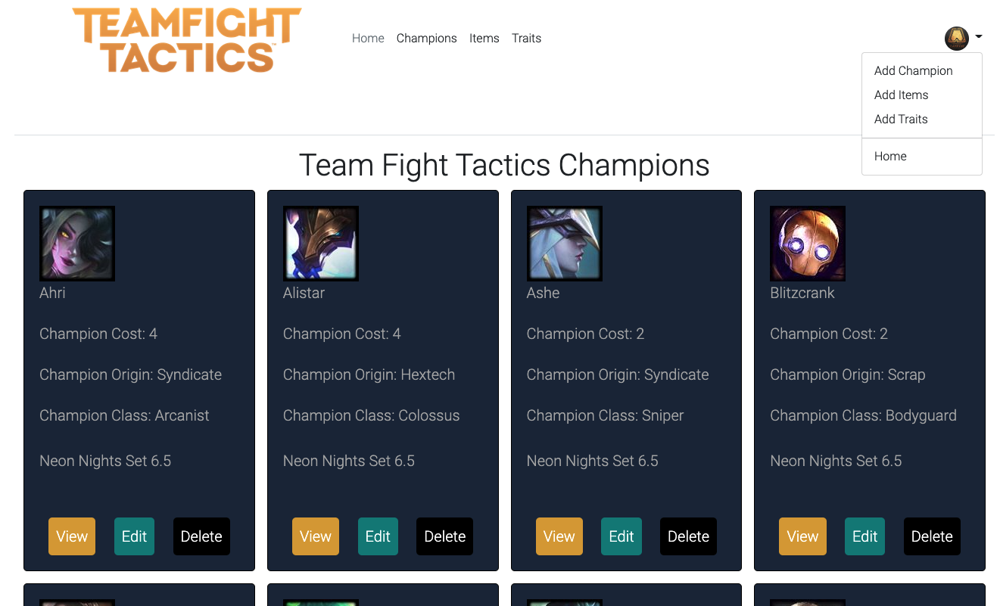
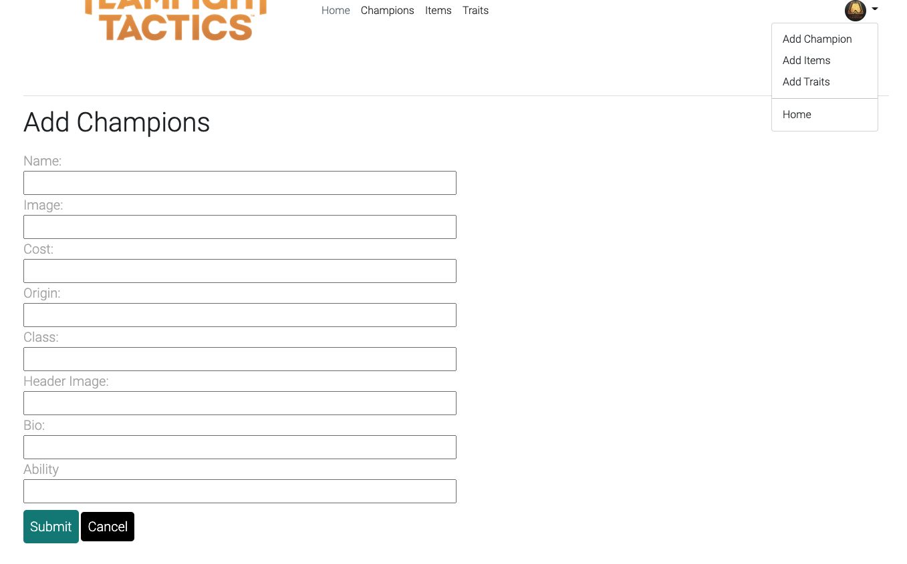
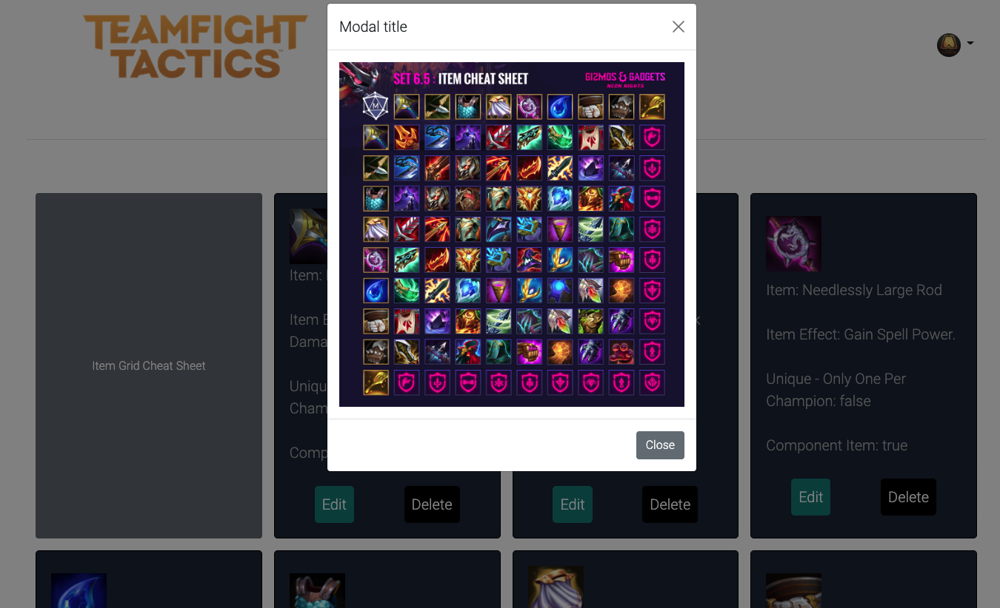

# Team-Fight-Tactics-DB
Hello! Welcome to the Team Fight Tactics DB. A backend application with a friendly user interface experience in mind. 
In this app the user can find out more about Team Fight Tactics. All the various champions, their lore and abilities, as well as the items in the game and what they do.
Within the app can user can add, edit or delete new champions and items as new patches and sets come out for Team Fight Tactics, which occur on a regular basis.

**Link to TFT DB** [Click Here](https://murmuring-shelf-59524.herokuapp.com/)

### Technologies Used
- HTML5
- JavaScript
- CSS3
- EJS
- Node.js
- Mongoose/MongoDB
- Express

### Wireframes:
Ended up heading away towards my original wireframes setup once I got to learning more about and using EJS.
https://excalidraw.com/#json=KF3BOqi3UqMWPzqYF9B0L,i9wDQnP53DcabRTBs1JeoQ

### Game Screenshots:

### MVP Goals:
- Allow user to get a list of champions/items.
- User can find out more about each champion and item.
- Champion and item list can be added, edited or deleted due to a regular cycle of new patches of the game.
- A fluid functioning app.

### Stretch Goals
- Search bar and function for all the data.
- Interactive component/item bar to discover what items can be combined.
- Interactive champion list to be able to make team compositions in a group/list.
- Add more data points and categories to the DB.
- Incorporate API to find player match history and information.
- Include other RIOT games into the app.
- Make app more complex

### Hurdles 
- Better time management.
- Trying to incorporate too many things and then getting discouraged when it wasn't working out as hoped.
- Be better at asking for help. 
- Learning and getting more comfortable with Bootstrap and EJS.

### Final Thoughts
I really enjoyed the project and making it, I actually am quite excited to better hone my programming skills and lessons moving forward to improve this app. 
I really want to continue working on this and adding in more functionality and incorporate more of my stretch goals as I become a better programmer. 
I hope users who love or want to learn more about TFT can enjoy and make use of this app!